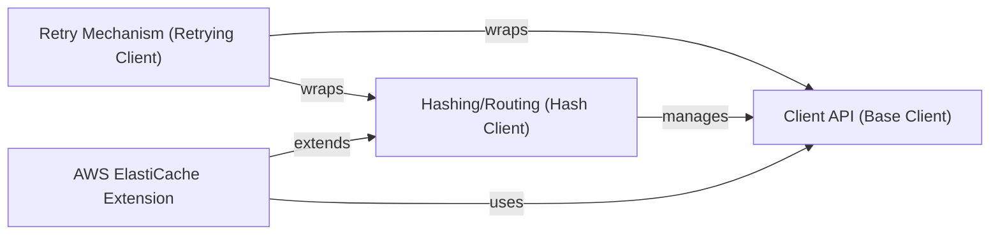

## Details

The Client Wrappers & Extensions subsystem in pymemcache provides enhanced client functionalities by building upon core client implementations. This design adheres to the "Extension/Plugin Architecture" and "Decorator Pattern" to add features like fault tolerance and dynamic cloud environment integration without altering the fundamental client logic.

### Client API (Base Client)

This is the foundational component, representing the basic interface for interacting with a single Memcached server. It encapsulates the direct network communication, handles socket operations, and implements the core Memcached protocol commands (e.g., set, get, delete). It also manages serialization and deserialization of data.

**Related Classes/Methods**:

- <a href="https://github.com/pinterest/pymemcache/blob/master/pymemcache/client/base.py#L1-L1" target="_blank" rel="noopener noreferrer">`pymemcache.client.base` (1:1)</a>

### Hashing/Routing (Hash Client)

This component extends the capabilities of the Base Client to manage interactions with multiple Memcached servers, forming a cluster. It employs a hashing algorithm (like Rendezvous Hash) to determine which server a given key should be routed to. It also incorporates basic mechanisms for handling server failures and retrying operations within the cluster.

**Related Classes/Methods**:

- <a href="https://github.com/pinterest/pymemcache/blob/master/pymemcache/client/hash.py#L1-L1" target="_blank" rel="noopener noreferrer">`pymemcache.client.hash` (1:1)</a>

### Retry Mechanism (Retrying Client)

This component acts as a wrapper (following the decorator pattern) around any other client (e.g., Base Client or Hash Client) to introduce automatic retry logic. It intercepts client calls and, in case of specified exceptions (e.g., network issues), re-attempts the operation a configurable number of times with a delay.

**Related Classes/Methods**:

- <a href="https://github.com/pinterest/pymemcache/blob/master/pymemcache/client/retrying.py#L1-L1" target="_blank" rel="noopener noreferrer">`pymemcache.client.retrying` (1:1)</a>

### AWS ElastiCache Extension

This specialized client is built upon the Hash Client and provides dynamic node discovery and management specifically for AWS ElastiCache clusters. It automates the process of identifying and connecting to cluster nodes by querying the ElastiCache configuration endpoint, eliminating the need for manual configuration updates when the cluster scales or changes.

**Related Classes/Methods**:

- <a href="https://github.com/pinterest/pymemcache/blob/master/pymemcache/client/ext/aws_ec_client.py#L1-L1" target="_blank" rel="noopener noreferrer">`pymemcache.client.ext.aws_ec_client` (1:1)</a>

### [FAQ](https://github.com/CodeBoarding/GeneratedOnBoardings/tree/main?tab=readme-ov-file#faq)