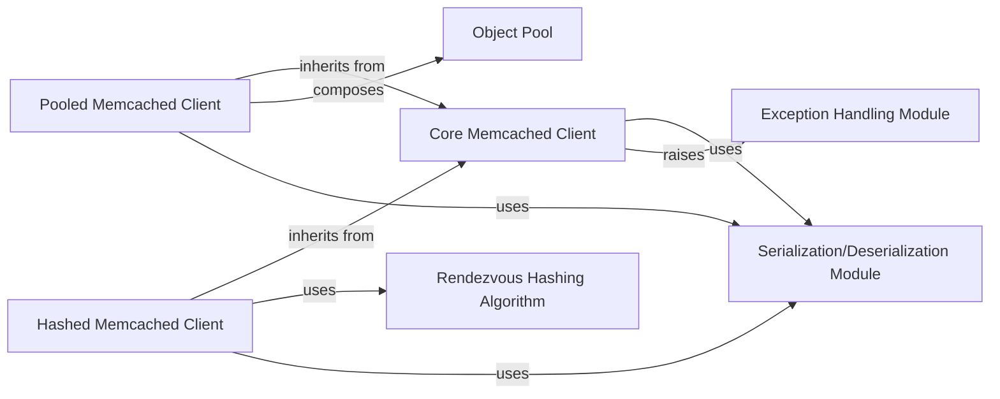

## Details

The `pymemcache` library is structured around a clear layered architecture, with a foundational `Client` component handling low-level interactions, and higher-level clients building upon it for advanced features like connection pooling and multi-server management. Serialization and exception handling are modularized, promoting separation of concerns.

### Core Memcached Client [[Expand]](./Core_Memcached_Client.md)

This is the fundamental interface for interacting with a single Memcached server. It manages the TCP/UNIX socket connection, sends Memcached commands (e.g., `set`, `get`, `delete`), parses responses, and integrates with the serialization/deserialization mechanism. It handles the low-level protocol details and serves as the base for all other client implementations.

**Related Classes/Methods**:

- <a href="https://github.com/pinterest/pymemcache/blob/master/pymemcache/client/base.py#L178-L1356" target="_blank" rel="noopener noreferrer">`pymemcache.client.base.Client` (178:1356)</a>

### Pooled Memcached Client

Extends the `Core Memcached Client` to provide connection pooling. Instead of opening and closing a connection for each operation, it reuses existing connections from a pool, improving performance and reducing overhead, especially in high-concurrency environments.

**Related Classes/Methods**:

- `pymemcache.client.pooled.PooledClient`

### Hashed Memcached Client

Extends the `Core Memcached Client` to manage interactions with multiple Memcached servers. It uses a hashing algorithm (like Rendezvous Hashing) to determine which server a particular key should be stored on or retrieved from, enabling distributed caching.

**Related Classes/Methods**:

- <a href="https://github.com/pinterest/pymemcache/blob/master/pymemcache/client/hash.py#L17-L469" target="_blank" rel="noopener noreferrer">`pymemcache.client.hash.HashClient` (17:469)</a>

### Serialization/Deserialization Module

This module provides the mechanisms for converting Python objects into bytes suitable for storage in Memcached and vice-versa. It defines default serializers (e.g., `LegacyWrappingSerde`, `PickleSerde`) and allows for custom serialization logic.

**Related Classes/Methods**:

- <a href="https://github.com/pinterest/pymemcache/blob/master/pymemcache/serde.py" target="_blank" rel="noopener noreferrer">`pymemcache.serde`</a>

### Exception Handling Module

Defines custom exception classes specific to Memcached operations (e.g., `MemcacheError`, `MemcacheClientError`, `MemcacheServerError`). These exceptions provide more granular error reporting than generic network or I/O errors, helping developers diagnose issues related to Memcached interactions.

**Related Classes/Methods**:

- <a href="https://github.com/pinterest/pymemcache/blob/master/pymemcache/exceptions.py" target="_blank" rel="noopener noreferrer">`pymemcache.exceptions`</a>

### Rendezvous Hashing Algorithm

Implements the Rendezvous Hashing (HRW) algorithm, which is used by the `HashClient` to consistently map keys to servers in a distributed Memcached setup. This algorithm minimizes key remapping when servers are added or removed, improving cache hit rates.

**Related Classes/Methods**:

- <a href="https://github.com/pinterest/pymemcache/blob/master/pymemcache/client/rendezvous.py#L3-L45" target="_blank" rel="noopener noreferrer">`pymemcache.client.rendezvous.RendezvousHash` (3:45)</a>

### Object Pool

A generic object pooling utility used by the `PooledClient` to manage and reuse `Client` instances (connections). It handles the creation, borrowing, and returning of objects to the pool, and can manage idle timeouts.

**Related Classes/Methods**:

- <a href="https://github.com/pinterest/pymemcache/blob/master/pymemcache/pool.py#L25-L134" target="_blank" rel="noopener noreferrer">`pymemcache.pool.ObjectPool` (25:134)</a>

### [FAQ](https://github.com/CodeBoarding/GeneratedOnBoardings/tree/main?tab=readme-ov-file#faq)