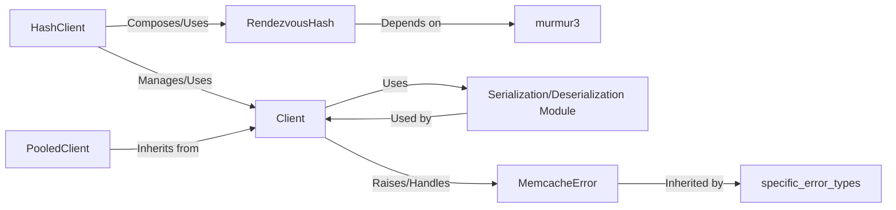

## Details

The `Multi-Server Client & Hashing` subsystem in `pymemcache` is fundamental for enabling distributed caching across multiple Memcached servers. It achieves this by extending the basic single-server client functionality with intelligent key routing using consistent hashing.

### HashClient

The primary client interface for interacting with multiple Memcached servers. It abstracts away the complexity of routing keys to the correct server by employing a consistent hashing algorithm, enabling distributed caching and fault tolerance. It manages a collection of individual `Client` instances, one for each server.

**Related Classes/Methods**:

- <a href="https://github.com/pinterest/pymemcache/blob/master/pymemcache/client/hash.py" target="_blank" rel="noopener noreferrer">`pymemcache.client.hash`</a>

### RendezvousHash

Implements the Rendezvous Hashing (HRW) algorithm, a consistent hashing technique crucial for `HashClient`. It deterministically distributes keys among a dynamic set of servers, ensuring that when servers are added or removed, only a minimal number of keys need to be remapped, thus reducing cache misses.

**Related Classes/Methods**:

- <a href="https://github.com/pinterest/pymemcache/blob/master/pymemcache/client/rendezvous.py" target="_blank" rel="noopener noreferrer">`pymemcache.client.rendezvous`</a>

### Client [[Expand]](./Client.md)

The foundational client class responsible for direct, low-level communication with a single Memcached server. It handles the Memcached protocol interactions, serialization/deserialization of data, and basic error handling. `HashClient` builds upon this class by managing multiple instances of it.

**Related Classes/Methods**:

- <a href="https://github.com/pinterest/pymemcache/blob/master/pymemcache/client/base.py" target="_blank" rel="noopener noreferrer">`pymemcache.client.base`</a>

### murmur3

This module provides the Murmur3 hash function, a fast, non-cryptographic hash function. It is specifically used by the `RendezvousHash` algorithm to compute hash values for server keys and data keys, which is essential for the deterministic distribution of keys.

**Related Classes/Methods**:

- <a href="https://github.com/pinterest/pymemcache/blob/master/pymemcache/client/murmur3.py" target="_blank" rel="noopener noreferrer">`pymemcache.client.murmur3`</a>

### PooledClient

A specialized client that extends the `Client` class to manage a pool of connections to a single Memcached server. This improves performance by reusing established connections rather than opening new ones for each operation.

**Related Classes/Methods**:

- `pymemcache.client.pooled`

### Serialization/Deserialization Module

This module provides the mechanisms for converting Python objects into a format suitable for storage in Memcached (serialization) and converting them back into Python objects upon retrieval (deserialization). It supports various serialization methods.

**Related Classes/Methods**:

- <a href="https://github.com/pinterest/pymemcache/blob/master/pymemcache/serde.py" target="_blank" rel="noopener noreferrer">`pymemcache.serde`</a>

### MemcacheError

The base class for all exceptions raised by the `pymemcache` client library, indicating various issues that can occur during Memcached operations (e.g., network errors, server errors, input errors).

**Related Classes/Methods**:

- <a href="https://github.com/pinterest/pymemcache/blob/master/pymemcache/exceptions.py" target="_blank" rel="noopener noreferrer">`pymemcache.exceptions`</a>

### [FAQ](https://github.com/CodeBoarding/GeneratedOnBoardings/tree/main?tab=readme-ov-file#faq)