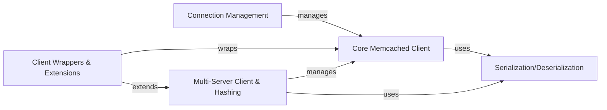

## Details

Abstract Components Overview

### Core Memcached Client [[Expand]](./Core_Memcached_Client.md)

The fundamental interface for interacting with a single Memcached server, handling low-level protocol, command execution, and direct connection management. It serves as the base for all higher-level client functionalities.

**Related Classes/Methods**:

- <a href="https://github.com/pinterest/pymemcache/blob/master/pymemcache/client/base.py#L178-L1356" target="_blank" rel="noopener noreferrer">`pymemcache.client.base.Client` (178:1356)</a>

### Connection Management

Manages a pool of `Core Memcached Client` instances to efficiently reuse network connections, thereby reducing the overhead associated with establishing new connections for each operation.

**Related Classes/Methods**:

- <a href="https://github.com/pinterest/pymemcache/blob/master/pymemcache/pool.py#L25-L134" target="_blank" rel="noopener noreferrer">`pymemcache.pool.ObjectPool` (25:134)</a>

- <a href="https://github.com/pinterest/pymemcache/blob/master/pymemcache/client/base.py#L1359-L1674" target="_blank" rel="noopener noreferrer">`pymemcache.client.base.PooledClient` (1359:1674)</a>

### Multi-Server Client & Hashing [[Expand]](./Multi_Server_Client_Hashing.md)

Extends client functionality to support interactions with multiple Memcached servers. It utilizes consistent hashing algorithms (e.g., Rendezvous Hash) to deterministically route keys to specific servers, enabling distributed caching and fault tolerance.

**Related Classes/Methods**:

- <a href="https://github.com/pinterest/pymemcache/blob/master/pymemcache/client/hash.py#L17-L469" target="_blank" rel="noopener noreferrer">`pymemcache.client.hash.HashClient` (17:469)</a>

- <a href="https://github.com/pinterest/pymemcache/blob/master/pymemcache/client/rendezvous.py#L3-L45" target="_blank" rel="noopener noreferrer">`pymemcache.client.rendezvous.RendezvousHash` (3:45)</a>

### Serialization/Deserialization

A dedicated module responsible for converting Python objects into a byte format suitable for storage in Memcached, and vice-versa. It supports various serialization methods (e.g., Pickle) and compression.

**Related Classes/Methods**:

- <a href="https://github.com/pinterest/pymemcache/blob/master/pymemcache/serde.py#L96-L121" target="_blank" rel="noopener noreferrer">`pymemcache.serde.PickleSerde` (96:121)</a>

- <a href="https://github.com/pinterest/pymemcache/blob/master/pymemcache/serde.py#L127-L167" target="_blank" rel="noopener noreferrer">`pymemcache.serde.CompressedSerde` (127:167)</a>

- <a href="https://github.com/pinterest/pymemcache/blob/master/pymemcache/serde.py#L173-L192" target="_blank" rel="noopener noreferrer">`pymemcache.serde.LegacyWrappingSerde` (173:192)</a>

### Client Wrappers & Extensions [[Expand]](./Client_Wrappers_Extensions.md)

Provides higher-level client implementations that wrap core or multi-server clients to add specialized functionalities. This includes automatic retries for transient network issues and dynamic node discovery for cloud environments like AWS ElastiCache.

**Related Classes/Methods**:

- <a href="https://github.com/pinterest/pymemcache/blob/master/pymemcache/client/retrying.py#L45-L176" target="_blank" rel="noopener noreferrer">`pymemcache.client.retrying.RetryingClient` (45:176)</a>

- <a href="https://github.com/pinterest/pymemcache/blob/master/pymemcache/client/ext/aws_ec_client.py#L20-L204" target="_blank" rel="noopener noreferrer">`pymemcache.client.ext.aws_ec_client.AWSElastiCacheHashClient` (20:204)</a>

### [FAQ](https://github.com/CodeBoarding/GeneratedOnBoardings/tree/main?tab=readme-ov-file#faq)